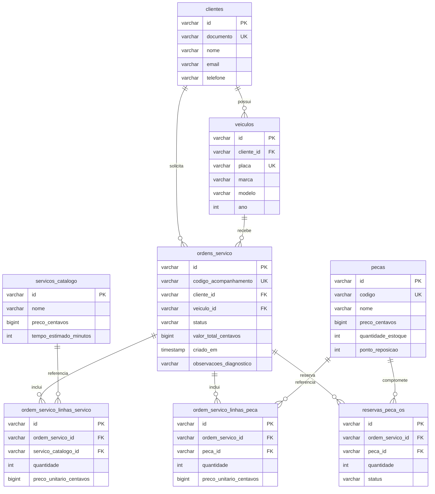

# Modelo relacional

O database `oficina` contém o mesmo conjunto de tabelas no `schema hml` e no
`schema prod`. Cada execução do Flyway seleciona exatamente um schema, evitando
mistura de dados entre os ambientes mesmo com uma única instância acadêmica.

As migrations versionadas da aplicação são a fonte de verdade do DDL. Este
diagrama documenta as relações funcionais e não substitui o Flyway.
